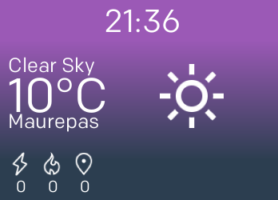

# feels-fitbit
A Fitbit Ionic & Versa clock face showing weather

## Weather API

Weather data comes from [DarkSky](https://darksky.net/)

## Resources

* Activities icons come from [Fitbit](https://github.com/Fitbit/sdk-design-assets)
* Weather icons come from [iconmonstr](https://iconmonstr.com)
* Colors are from [Flatuiolors](https://flatuicolors.com/palette/defo)
